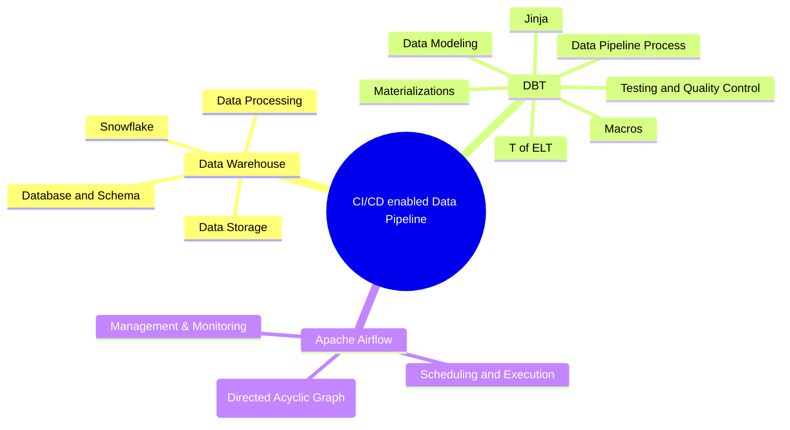

  <a href="#features">Features</a> •
  <a href="#demo">Demo</a> •
  <a href="#screenshots">Screenshots</a> •
  <a href="#installation">Installation</a> •
  <a href="#tech-stack">Tech Stack</a>

An ELT pipeline with the power of DBT & Snowflake & Airflow & CI/CD. ✨

## ✨ Features

